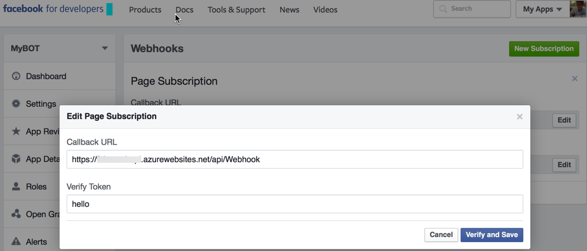

# Facebook Messenger Bot WebAPI Template

This project is the template to build the Facebook Messenger Bot with  ASP.NET Web API. This fork use the Bot.Messenger nuget library https://www.nuget.org/packages/Bot.Messenger/1.0.0

## Steps to run

- Open the project and add your Facebook Page Token & App Secret at the Controllers/WebhookController.cs.

```csharp
        string _pageToken = "page token";
        string _appSecret = "app secret";
        string _verifyToken = "hello";
```
- OR add to web.config.
```
<configuration>
  <configSections>
    <sectionGroup name="applicationSettings" type="System.Configuration.ApplicationSettingsGroup, System, Version=4.0.0.0, Culture=neutral, PublicKeyToken=b77a5c561934e089">
      <section name="Bot.Messenger.Settings" type="System.Configuration.ClientSettingsSection, System, Version=4.0.0.0, Culture=neutral, PublicKeyToken=b77a5c561934e089" requirePermission="false" />
    </sectionGroup>
  </configSections>
  <applicationSettings>
    <Bot.Messenger.Settings>
      <setting name="PageToken" serializeAs="String">
        <value>page token</value>
      </setting>
      <setting name="AppSecret" serializeAs="String">
        <value>app secret</value>
      </setting>
      <setting name="VerifyToken" serializeAs="String">
        <value>hello</value>
      </setting>
    </Bot.Messenger.Settings>
  </applicationSettings>
  ...
</configuration>
```

- Credentials are fetched from web.config ApplicationSettings when the CreateInstance method is called without a credentials parameter or if the parameterless constructor is used to initialize the MessengerPlatform class. This holds true for all types that inherit from Bot.Messenger.ApiBase. Here are is the code at the Controllers/WebhookController.cs 

```csharp
        private MessengerPlatform _Bot { get; set; }
        protected override void Initialize(HttpControllerContext controllerContext)
        {
            base.Initialize(controllerContext);

            //_Bot = MessengerPlatform.CreateInstance();
            //_Bot = new MessengerPlatform();
            _Bot = MessengerPlatform.CreateInstance(
                MessengerPlatform.CreateCredentials(_appSecret, _pageToken, _verifyToken));
        }
```

- In the Facebook webhook setting page. Verify token is the value of the key "hub.verify_token".  (this sample is hello)

```csharp
  if (_Bot.Authenticator.VerifyToken(querystrings["hub.verify_token"]))
```




